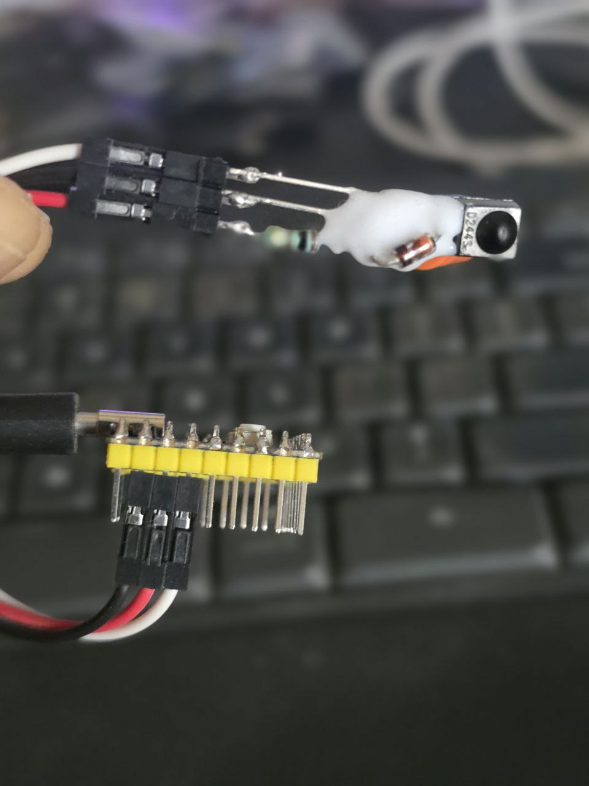

# RP2040-Zero Multi-Mode CIR Transceiver

A high-performance, dual-core Infrared (IR) receiver and controller built on the Raspberry Pi RP2040. This project spoofs a Microsoft eHome Infrared Transceiver to provide native, driverless media control on Windows and Linux, while offering a secondary "RAW" mode for custom automation via HID packets.

<p align="center">
  
  
</p>

## 🚀 Key Features
- **Dual-Core Architecture**: 
    - **Core 0**: Manages the USB TinyUSB stack, System Status, and Mode Toggling.
    - **Core 1**: Dedicated to high-precision IR pulse sampling and decoding (Zero-jitter).
- **Microsoft eHome Spoofing**: Uses official VID (0x045E) and PID (0x006D) to be recognized as a system-level media device.
- **Multi-HID Composite Interface**: Functions simultaneously as a Consumer Control device (Media keys) and a Keyboard (System macros/Numbers).
- **Dual Operation Modes**:
    - 🟢 **CIR Mode (Green)**: Native Media/Keyboard control for Windows & Linux.
    - 🔵 **RAW Mode (Blue)**: Sends raw IR hex codes over a 64-byte HID pipe (Report ID 3) for Linux-side scripting.
- **Hardware Optimized**: Specifically designed for the RP2040-Zero with a direct-solder pinout.

## 🛠 Hardware Setup

### Components
- **Microcontroller**: Waveshare RP2040-Zero (or compatible clone).
- **IR Receiver**: TSOP38238, TSOP1838, or similar ($38\text{ kHz}$ carrier).

### Pinout (Direct Solder optimized)
| IR Receiver Pin | RP2040-Zero Pin | Function |
| :--- | :--- | :--- |
| GND | GND | Ground |
| VCC | 3V3 | 3.3V Power |
| OUT (Data) | GP29 | IR Signal Input |

> [!TIP]
> **Noise Reduction**: For the best performance in high-EMI environments, place a $100\Omega$ resistor in series with the 3V3 line and a $100\mu F$ capacitor across the IR receiver's VCC and GND.

## ⌨️ Key Mappings (CIR Mode)
| Action | Mapping | Key Type |
| :--- | :--- | :--- |
| Play/Pause | Media Play/Pause | Consumer |
| Volume Up/Down | Media Vol + / - | Consumer |
| Suspend/Resume | System Sleep | Consumer |
| Fullscreen | f | Keyboard |
| Seek Fwd/Bwd | Right/Left Arrows | Keyboard |
| Jump 1m Fwd/Bwd | Ctrl + Right/Left | Keyboard |
| Lock PC | GUI (Win) + L | Keyboard |
| Close Window | Alt + F4 | Keyboard |
| Switch Window | Alt + Tab | Keyboard |
| Navigation | Numbers 1-9 | Keyboard |

## 🐧 Linux Configuration (Ubuntu/Debian)

To allow the device to communicate via raw HID and wake the system from sleep, add a udev rule.

1. **Create the rule file**:
```bash
sudo nano /etc/udev/rules.d/99-ir-receiver.rules
```

2. **Paste the following**:
```bash
# Enable Wakeup for the Microsoft Spoof
ACTION=="add", SUBSYSTEM=="usb", ATTRS{idVendor}=="045e", ATTRS{idProduct}=="006d", ATTR{power/wakeup}="enabled"

# Grant permissions for RAW HID access
SUBSYSTEM=="hidraw", ATTRS{idVendor}=="045e", ATTRS{idProduct}=="006d", MODE="0666"
```

3. **Reload rules**:
```bash
sudo udevadm control --reload-rules && sudo udevadm trigger
```

## 🔨 Development & Upload

This project uses PlatformIO with the Earle Philhower RP2040 core.

### platformio.ini
```ini
[env:rp2040_zero]
platform = https://github.com/maxgerhardt/platform-raspberrypi.git
board = pico
framework = arduino
board_build.core = earlephilhower
build_flags = -DUSE_TINYUSB
lib_deps = 
    z3t0/IRremote @ ^4.4.1
    adafruit/Adafruit NeoPixel @ ^1.12.0
    adafruit/Adafruit TinyUSB Library @ ^3.3.3
```

### Build and Flash
1. Press and hold the **BOOT** button.
2. Connect the **USB-C** cable.
3. Run `pio run -t upload`.

## 🔍 Troubleshooting & Verification
### 1. Verification (Does the OS see it?)
After plugging in the device, run dmesg | tail -n 20. A successful connection should look like this:

```plaintext
[71687.939381] usb 3-2.3: New USB device found, idVendor=045e, idProduct=006d, bcdDevice= 1.00
[71687.939383] usb 3-2.3: New USB device strings: Mfr=1, Product=2, SerialNumber=3
[71687.939385] usb 3-2.3: Product: eHome Infrared Transceiver
[71687.939388] usb 3-2.3: Manufacturer: Microsoft
[71688.012626] cdc_acm 3-2.3:1.0: ttyACM1: USB ACM device
[71688.021583] input: Microsoft eHome Infrared Transceiver Consumer Control as /devices/pci0000:00/0000:00:08.1/0000:06:00.4/usb3/3-2/3-2.3/3-2.3:1.2/0003:045E:006D.002D/input/input68
[71688.073778] input: Microsoft eHome Infrared Transceiver Keyboard as /devices/pci0000:00/0000:00:08.1/0000:06:00.4/usb3/3-2/3-2.3/3-2.3:1.2/0003:045E:006D.002D/input/input70
[71688.124819] hid-generic 0003:045E:006D.002D: input,hiddev2,hidraw5: USB HID v1.11 Keyboard [Microsoft eHome Infrared Transceiver] on usb-0000:06:00.4-2.3/input2
```


### 2. Viewing Raw Events (CIR Mode - Green LED)
In CIR mode, the device acts as a native input. To see events as the Linux kernel processes them:

Install evtest:``` sudo apt install evtest ```

Run it: ``` sudo evtest ```

Select the device labeled "Microsoft eHome Infrared Transceiver Consumer Control".

Press buttons on your remote; you should see EV_KEY events with specific usage IDs (e.g., KEY_PLAYPAUSE).

### 3. Viewing Raw HID Packets (RAW Mode - Blue LED)
In RAW mode, the device sends 4-byte IR hex codes directly to a hidraw node.

Note on Buffering: Linux terminals often buffer output. To see events instantly, use cat or stdbuf:

Bash
### Method 1: Instant Hex dump
``` sudo cat /dev/hidraw5 | xxd -c 5 ```

### Method 2: Using stdbuf to disable line buffering
``` sudo stdbuf -i0 -o0 -e0 hexdump -C /dev/hidraw5 ```

### 4. Common Hardware Issues
Device "Silent" on Serial: Ensure DEBUG is set to 1 in main.cpp. Note that Serial.begin may take a moment to initialize; the code includes a 2-second delay in setup() to catch early messages.

GP29 Noise: Since GP29 is an ADC-capable pin, it can be sensitive to power ripple. If you see "ghost" IR codes in the console, add a 100µF capacitor between the TSOP's VCC and GND pins.